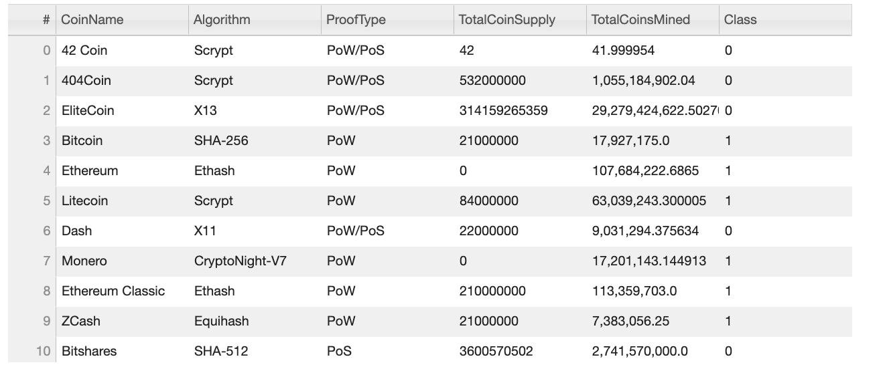
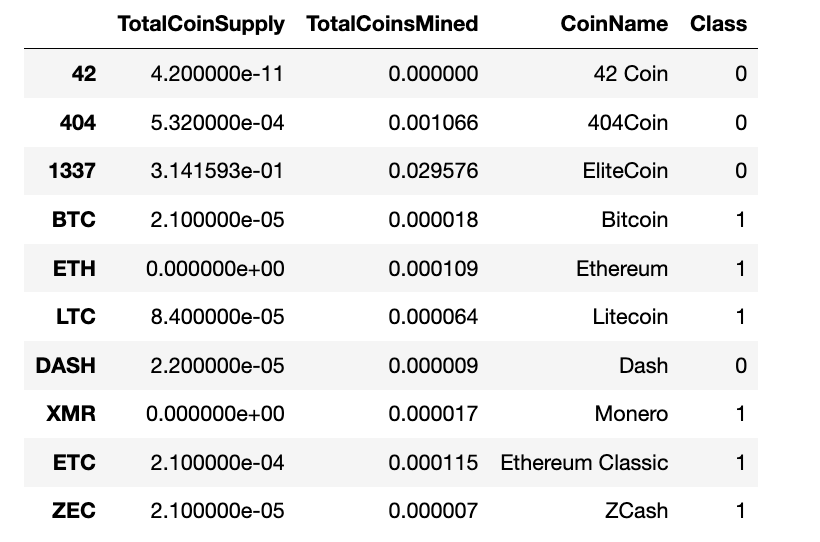
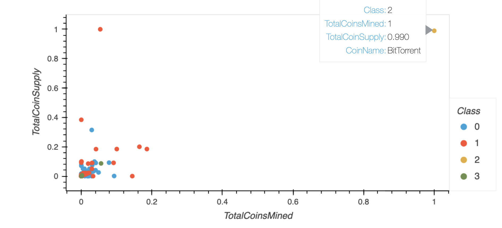
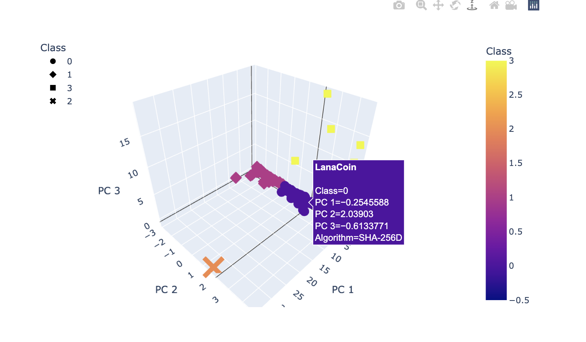

# Cryptocurrencies

## Project Overview

This project uses unsupervised machine learning to create a classification system for tradable cryptocurrencies. The [data](/Resources/crypto_data.csv) was retrieved from [CryptoCompare](https://min-api.cryptocompare.com/data/all/coinlist).

The following steps were taken during the analysis:

 - Preprocessing and cleaning the data
- Reducing Data Dimensions using Principal Component Analysis (PCA)
- Cluster the cryptocurrencies using K-means algorithm from sklearn
- Visualizing the results with 2d and 3d scatter plots using plotly and hvplot

## Results
After removing null values, filtering the data for only mined cryptocurrencies, and using get_dummies() to create variables for text features, the cleaned data yielded 532 tradable cryptocurrencies.

The next step is determining how many clusters should be used in the analysis.  An elbow curve shows that the sharp decrease in inertia tapers off around 4.  Therefore K=4 was used in the model.

The K-means algorithm is then used to cluster the cryptocurrencies.

### Table of Cryptocurrencies 

### Scaled DataFrame 
MinMaxScaler method is used to scale the TotalCoinSupply and TotalCoinsMined columns

### 2D Scatter Plot for TotalCoinSupply and TotalCoinsMined
An hvplot scatter plot is then rendered to visualize the information

### 3D Scatter Plot
A 3D hvplot scatter plot clearly displays the four clusters distributed across the three principal components.

